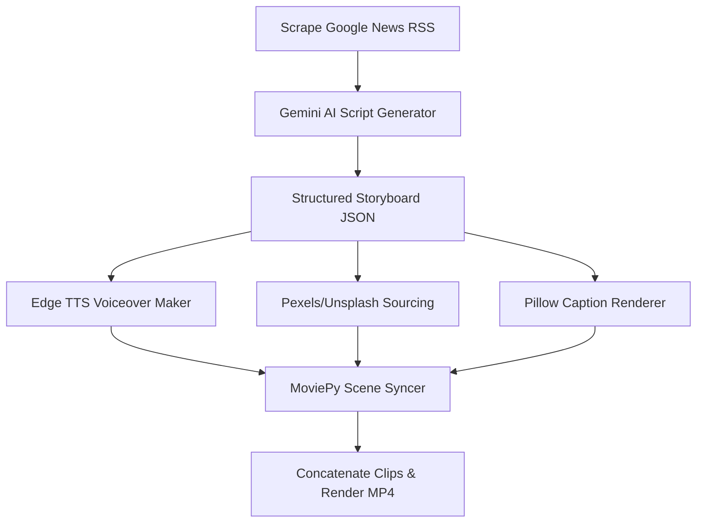

# 🎬 Task 1: AI Video Generation Tool

A production-grade Python tool that automatically scrapes trending news, writes engaging video scripts, generates realistic narration voiceovers, downloads matching visual assets, and renders high-impact, professional social-media vertical short videos (9:16) with synchronized text overlays.

---

## 🚀 Key Features

*   **Google News Scraping:** Parses the latest hot topics and summaries from the Google News RSS feed automatically.
*   **Dual-Engine AI Script Generator:** Generates a structured scene-by-scene storyboard (narration, text overlays, visual query prompts) using Google Gemini, with candidate model failovers (`gemini-3.5-flash`, `gemini-2.5-flash`, etc.) and a local rules-based fallback.
*   **Realistic TTS Voiceovers:** Leverages `edge-tts` to generate clean, professional human voice synthesis (no API keys required).
*   **Robust Visual Sourcing:** Sourced from **Pexels API** with automatic, smart scraping fallback on **Unsplash** and **Picsum** to guarantee matching visuals under any circumstance.
*   **Pillow-Powered Custom Captions:** Creates premium semi-transparent card overlays using `PIL` for subtitle rendering, bypassing system-dependent ImageMagick constraints in MoviePy.
*   **Shorts / Reels Ready:** Automatically crops, centers, and outputs vertical videos (1080x1920, 9:16) optimized for modern social media.

---

## 🛠️ Pipeline Details & Steps Followed



1.  **Extraction:** Scrapes Google News top articles to pick real-time topics.
2.  **Storyboarding:** Sends the headline and summary to Google Gemini to structure the storyboard into exactly 4–5 scenes with voice scripts and search keywords.
3.  **Voiceover Production:** Generates a clean `.mp3` voiceover for each scene.
4.  **Image Fetching:** Queries Unsplash/Pexels for high-quality portrait visual assets matching the scene's keywords.
5.  **Captioning:** Draws premium, semi-transparent text cards onto the image frames using Pillow, wrapping text dynamically.
6.  **Compilation:** Clips the images to match each scene's voice length, joins them, and outputs a single high-quality vertical `.mp4`.

---

## 💻 How to Run

### Prerequisite Dependencies
Make sure you have Node, Python, and FFmpeg installed on your system.

### Option A: Interactive Streamlit UI (Recommended)
This web app features trending article selection cards, custom topic inputs, voice selectors, and real-time generation feedback logs with an embedded video player preview.
```powershell
streamlit run task1_video_generator/src/ui.py
```

### Option B: Command Line Interface (CLI)
Generate a video directly from your terminal:
```powershell
# Auto-generate video from top trending news story
python -m task1_video_generator.src.main

# Generate video from a custom topic
python -m task1_video_generator.src.main --topic "Artificial Intelligence in Medicine" --voice "en-US-GuyNeural"
```

---

## 📄 Output Deliverables
*   **CLI Entry Point:** [main.py](file:///E:/Syn%20Assesment/task1_video_generator/src/main.py)
*   **Web App Interface:** [ui.py](file:///E:/Syn%20Assesment/task1_video_generator/src/ui.py)
*   **Sourced Assets & Compiled Videos:** Generated files are deployed dynamically to the [output](file:///E:/Syn%20Assesment/task1_video_generator/output/) directory.
